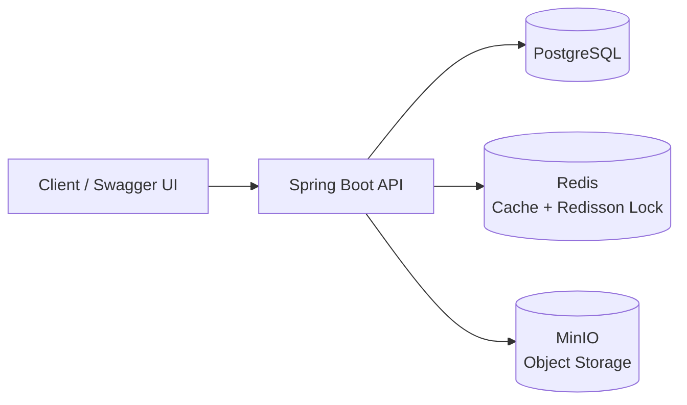

# Gaming Gear API

Backend REST API cho một hệ thống e-commerce bán Gaming Gear. Đây là dự án học tập cá nhân, được xây dựng để thực hành quy trình làm một backend Spring Boot từ thiết kế database, xác thực, nghiệp vụ đặt hàng đến cache, xử lý đồng thời, lưu trữ ảnh và CMS.

## Chức năng chính

- Xác thực bằng JWT: đăng ký, đăng nhập, refresh token và đăng xuất.
- Phân quyền `CUSTOMER` và `ADMIN`.
- Quản lý category, brand, product, product variant và product image.
- Danh sách sản phẩm có lọc theo category/brand/từ khóa, phân trang và sắp xếp.
- Giỏ hàng: thêm, cập nhật số lượng, xóa item và xóa toàn bộ giỏ hàng.
- Đặt hàng COD từ giỏ hàng, xem lịch sử đơn hàng, hủy đơn và quản lý trạng thái đơn hàng.
- Redis cache cho catalog và dữ liệu CMS; cache được xóa khi dữ liệu liên quan thay đổi.
- Redisson lock bảo vệ tồn kho khi checkout, hủy đơn hoặc cập nhật variant để tránh overselling và lost update.
- MinIO lưu ảnh cho product, banner và bài viết; database chỉ lưu object key.
- CMS cho banner, static page và article với vòng đời `DRAFT`, `PUBLISHED`, `ARCHIVED`.
- Swagger UI để khám phá và gọi API.

## Kiến trúc tổng quát



### Một vài luồng đáng chú ý

**Checkout an toàn với tồn kho**

1. Backend lấy các product variant trong giỏ hàng.
2. Redisson khóa các variant theo thứ tự cố định.
3. Transaction kiểm tra tồn kho, tạo `Order`/`OrderItem`, trừ stock và xóa giỏ hàng.
4. Backend giải phóng lock, kể cả khi có lỗi.

**Upload ảnh**

1. Admin gửi `multipart/form-data`.
2. Backend kiểm tra file ảnh và dung lượng.
3. File được lưu tại MinIO; database chỉ lưu `objectKey`.
4. Response tạo public URL từ `MINIO_PUBLIC_URL` để client hiển thị ảnh.

**CMS**

Admin tạo hoặc cập nhật nội dung ở trạng thái `DRAFT`, sau đó xuất bản. Public API chỉ trả về nội dung `PUBLISHED`.

## Công nghệ sử dụng

| Nhóm | Công nghệ |
| --- | --- |
| Ngôn ngữ / Framework | Java 21, Spring Boot 4.1, Gradle |
| Web / Validation | Spring Web MVC, Jakarta Validation |
| Security | Spring Security, JWT, BCrypt |
| Database | PostgreSQL 17, Spring Data JPA, Hibernate, Flyway |
| Cache / Concurrent | Redis 7, Spring Cache, Redisson |
| Object storage | MinIO |
| API documentation | springdoc-openapi / Swagger UI |
| Hỗ trợ code | Lombok, MapStruct |
| Local infrastructure | Docker Compose |

## Cấu trúc source chính

```text
src/main/java/com/tuanviet/gaminggear
├── common/       # ApiResponse dùng chung
├── config/       # Security, Redis, Redisson, MinIO, Swagger
├── controller/   # REST endpoints
├── dto/          # Request và response DTO
├── entity/       # JPA entities
├── exception/    # Custom exception và GlobalExceptionHandler
├── mapper/       # Chuyển đổi entity <-> DTO
├── repository/   # Spring Data JPA repositories
├── security/     # JWT filter và UserDetails
└── service/      # Business logic
```

## Yêu cầu trước khi chạy

- JDK 21.
- Docker Desktop đang chạy.
- Git.

Không cần cài PostgreSQL, Redis hoặc MinIO trực tiếp trên máy vì Docker Compose sẽ chạy ba service này.

## Cấu hình biến môi trường

Tạo file `.env` từ file mẫu:

```powershell
Copy-Item .env.example .env
```

Không commit file `.env`. File này chứa mật khẩu local và JWT secret; `.gitignore` đã bỏ qua nó.

Các biến quan trọng:

| Biến | Mục đích |
| --- | --- |
| `POSTGRES_DB`, `POSTGRES_USER`, `POSTGRES_PASSWORD` | Kết nối PostgreSQL |
| `JWT_SECRET_BASE64` | Khóa ký JWT, phải là chuỗi Base64 hợp lệ |
| `REDIS_HOST`, `REDIS_HOST_PORT` | Kết nối Redis khi chạy backend trên máy |
| `MINIO_ROOT_USER`, `MINIO_ROOT_PASSWORD` | Tài khoản quản trị MinIO local |
| `MINIO_ENDPOINT` | Endpoint MinIO khi chạy backend trên máy |
| `MINIO_PUBLIC_URL` | URL được trả về cho client để hiển thị ảnh |
| `APP_HOST_PORT` | Port của API khi chạy toàn bộ bằng Docker Compose |

Giá trị `JWT_SECRET_BASE64` trong `.env.example` chỉ là ví dụ để chạy local. Khi deploy, hãy thay bằng secret ngẫu nhiên. Có thể tạo một chuỗi Base64 32 byte bằng PowerShell:

```powershell
$bytes = New-Object byte[] 32
$rng = [System.Security.Cryptography.RandomNumberGenerator]::Create()
$rng.GetBytes($bytes)
[Convert]::ToBase64String($bytes)
```

## Chạy toàn bộ bằng Docker

Đây là cách gần với môi trường deploy nhất: API, PostgreSQL, Redis và MinIO cùng chạy trong Docker.

Docker Compose tự cấu hình API container kết nối nội bộ tới PostgreSQL, Redis và MinIO. Vì vậy các host port như `5436` hay `6380` chỉ phục vụ việc truy cập từ máy của em, không phải địa chỉ mà API container dùng.

```powershell
docker compose up --build -d
docker compose ps
```

Lần build đầu tiên có thể mất vài phút vì Docker cần tải Java image và Gradle dependencies. Khi API đã khởi động, truy cập:

| Service | URL |
| --- | --- |
| Swagger UI | http://localhost:8080/swagger-ui/index.html |
| OpenAPI JSON | http://localhost:8080/v3/api-docs |
| MinIO Console | http://localhost:9001 |
| PostgreSQL | `localhost:5436` |
| Redis | `localhost:6380` |

Xem log của backend khi cần debug:

```powershell
docker compose logs -f api_gaming
```

> Nếu đang chạy `bootRun` trên máy, hãy dừng nó trước khi chạy full Docker vì cả hai đều dùng port `8080`.

## Chạy backend trên máy, infrastructure bằng Docker

Cách này phù hợp khi code và debug trong IDE:

```powershell
docker compose up -d postgres_gaming redis_gaming minio_gaming
.\gradlew.bat bootRun
```

Backend sẽ đọc `.env` và kết nối tới `localhost:5436`, `localhost:6380`, `localhost:9000`.

Kiểm tra build trước khi push:

```powershell
.\gradlew.bat build
```

## Swagger và phân quyền

Swagger UI có tại:

```text
http://localhost:8080/swagger-ui/index.html
```

Đăng nhập qua `POST /api/v1/auth/login`, copy `accessToken`, bấm **Authorize** trong Swagger và dán token thô. Swagger sẽ tự thêm tiền tố `Bearer`.

Các API dưới `/api/v1/admin/**` yêu cầu quyền `ADMIN`. Khi đăng ký qua API, user mới mặc định nhận quyền `CUSTOMER`; để thử admin API ở local, gán thêm quyền `ADMIN` cho user trong database.

## Các nhóm API

| Nhóm | Base path |
| --- | --- |
| Authentication | `/api/v1/auth` |
| Public catalog | `/api/v1/categories`, `/api/v1/brands`, `/api/v1/products` |
| Cart | `/api/v1/cart` |
| Order | `/api/v1/orders` |
| Public CMS | `/api/v1/banners`, `/api/v1/pages`, `/api/v1/articles` |
| Admin | `/api/v1/admin/**` |

Danh sách endpoint, request body và response đầy đủ được hiển thị trực tiếp trên Swagger UI.

## Dừng hoặc reset môi trường Docker

Dừng containers nhưng giữ database và file MinIO:

```powershell
docker compose down
```

Reset toàn bộ dữ liệu local:

```powershell
docker compose down -v
```

> Lệnh có `-v` xóa PostgreSQL volume và MinIO volume. Chỉ dùng khi em thực sự muốn xóa dữ liệu local.

## Phạm vi hiện tại

- Backend API, chưa có frontend.
- Thanh toán hiện tại là COD.
- Có thể mở rộng tiếp bằng dashboard admin, voucher hoặc tích hợp cổng thanh toán online.
