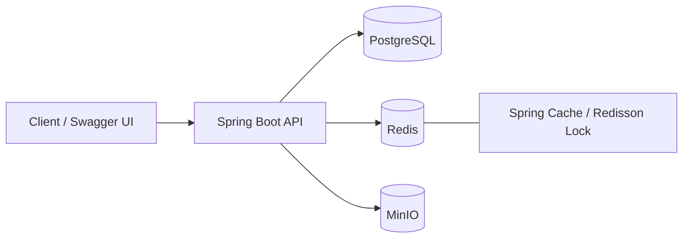
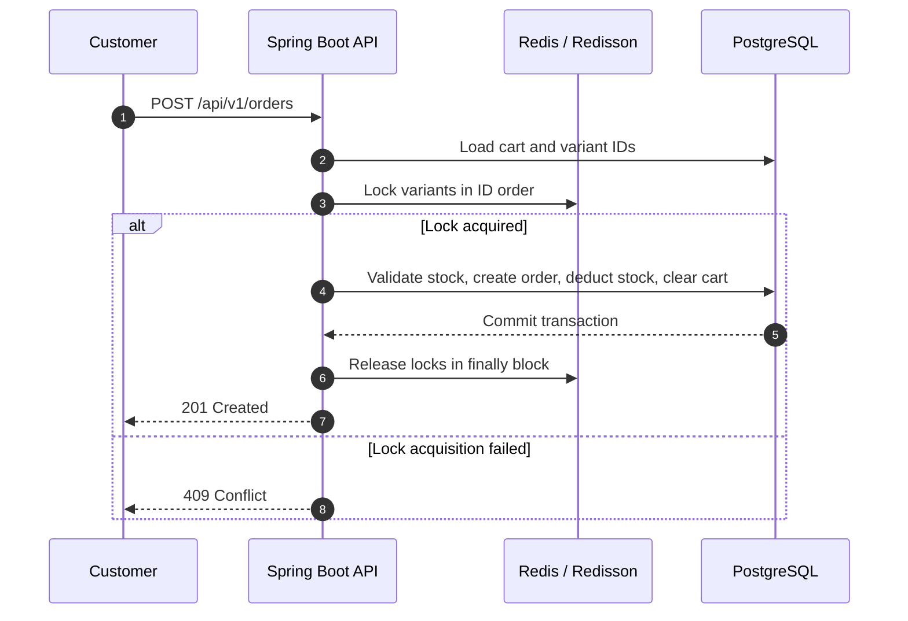
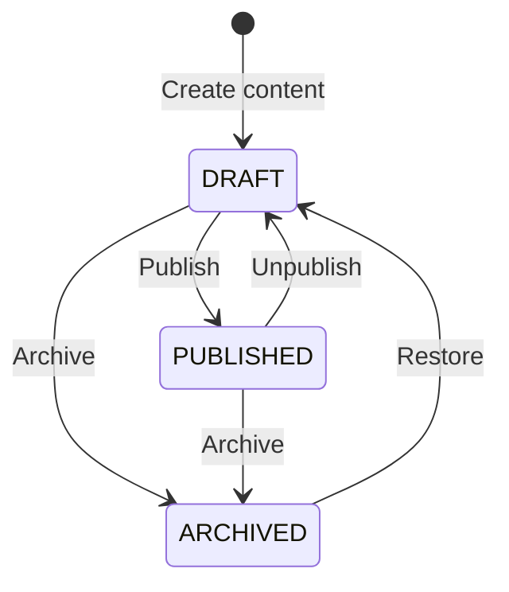

# 🎮 Gaming Gear API

> A RESTful backend for a Gaming Gear e-commerce platform, built with Java 21 and Spring Boot 4.1. The project focuses on core backend functionalities, including authentication, product catalog management, shopping cart, order processing, concurrency handling, image storage, and CMS.

## ✨ Features

* **Authentication & authorization:** Registration, login, token refresh, logout, and role-based authorization with `CUSTOMER` / `ADMIN` using JWT.
* **Catalog:** Manage categories, brands, products, variants, and images. Product listing supports search, filtering, pagination, and sorting.
* **Cart & order:** Add, update, and remove cart items, COD checkout, order history, order cancellation, and order status management.
* **Redis cache:** Caches categories, brands, product lists/details, and CMS data. Related cache entries are invalidated whenever the underlying data changes.
* **Redisson lock:** Protects inventory during checkout, order cancellation, and variant updates, reducing the risk of overselling and lost updates.
* **MinIO:** Stores images for products, banners, and articles. The database stores only the corresponding `objectKey`.
* **CMS:** Manage banners, static pages, and articles with the lifecycle states `DRAFT`, `PUBLISHED`, and `ARCHIVED`.
* **API documentation:** Swagger UI provides API documentation and an interactive environment for testing endpoints directly.

## 🧰 Tech Stack

| Category             | Technology                                        |
| -------------------- | ------------------------------------------------- |
| Backend              | Java 21, Spring Boot 4.1.0, Gradle                |
| Database             | PostgreSQL 17, Spring Data JPA, Hibernate, Flyway |
| Security             | Spring Security, JJWT, BCrypt                     |
| Cache & concurrency  | Redis 7, Spring Cache, Redisson 4.7.0             |
| Object storage       | MinIO 9.0.1                                       |
| API documentation    | springdoc-openapi / Swagger UI                    |
| Supporting libraries | Lombok, MapStruct                                 |
| Local infrastructure | Docker Compose                                    |

## 🏗️ High-Level Architecture



## 🔒 Checkout and Inventory Flow



Locks are acquired in a fixed order to reduce the risk of deadlocks. Every acquired lock is released in a `finally` block.

## 📝 CMS Content Lifecycle



This lifecycle is shared by banners, static pages, and articles. Public APIs only return content with the `PUBLISHED` status.

## 🚀 Running the Project

### Requirements

* JDK 21
* Docker Desktop
* Git

PostgreSQL, Redis, and MinIO are provided through Docker Compose, so you do not need to install these services directly on the host machine.

### 1. Configure the Environment

Create a `.env` file from the provided example:

```powershell
Copy-Item .env.example .env
```

The main environment variables include `POSTGRES_*`, `JWT_SECRET_BASE64`, `REDIS_*`, and `MINIO_*`.

The `.env` file contains local configuration and must not be committed to version control.

### 2. Start the Entire Stack with Docker Compose

```powershell
docker compose up --build -d
docker compose ps
```

| Service          | Local Address                               |
| ---------------- | ------------------------------------------- |
| API / Swagger UI | http://localhost:8080/swagger-ui/index.html |
| OpenAPI JSON     | http://localhost:8080/v3/api-docs           |
| MinIO Console    | http://localhost:9001                       |
| PostgreSQL       | `localhost:5436`                            |
| Redis            | `localhost:6380`                            |

View API logs:

```powershell
docker compose logs -f api_gaming
```

> Stop `bootRun` before starting Docker Compose because both use port `8080`.

### Run the API Locally with Infrastructure in Docker

```powershell
docker compose up -d postgres_gaming redis_gaming minio_gaming
.\gradlew.bat bootRun
```

Verify the build:

```powershell
.\gradlew.bat build
```

## 📚 Swagger and Authorization

Swagger UI: http://localhost:8080/swagger-ui/index.html

Authentication flow in Swagger:

1. Call `POST /api/v1/auth/login` to obtain an `accessToken`.
2. Click **Authorize** and paste the access token.
3. Swagger automatically adds the `Bearer` prefix to requests that require authentication.

All endpoints under `/api/v1/admin/**` require the `ADMIN` role.

## 🗂️ Source Structure

```text
src/main/java/com/tuanviet/gaminggear
├── common/       # Shared ApiResponse
├── config/       # Security, Redis, Redisson, MinIO, Swagger
├── controller/   # REST endpoints
├── dto/          # Request and response DTOs
├── entity/       # JPA entities
├── exception/    # Custom exceptions and GlobalExceptionHandler
├── mapper/       # Entity <-> DTO mapping
├── repository/   # Spring Data JPA repositories
├── security/     # JWT filter and UserDetails
└── service/      # Business logic
```

## 🌱 Demo Data

The `scripts/seed_demo_catalog.sql` script generates demo catalog data including 5 categories, 12 brands, 330 products, and 339 variants.

> Warning: This script is intended for local development only. It deletes existing business data, including users, carts, orders, catalog data, and CMS content. The `roles` table and Flyway migration history are preserved.

After the Docker containers have started, run the following command from the project root:

```powershell
[Console]::OutputEncoding = [System.Text.UTF8Encoding]::new($false)
Get-Content -Raw scripts/seed_demo_catalog.sql |
  docker compose exec -T postgres_gaming sh -c 'psql -v ON_ERROR_STOP=1 -U "$POSTGRES_USER" -d "$POSTGRES_DB"'
```

Product model names are based on publicly available catalogs from GEARVN. Prices, inventory quantities, and descriptions are demo data.

The script does not download or copy images from third-party sources.

## 🧹 Stop or Reset the Docker Environment

```powershell
# Stop containers while preserving PostgreSQL data and MinIO files
docker compose down

# Remove all local PostgreSQL and MinIO volume data
docker compose down -v
```
